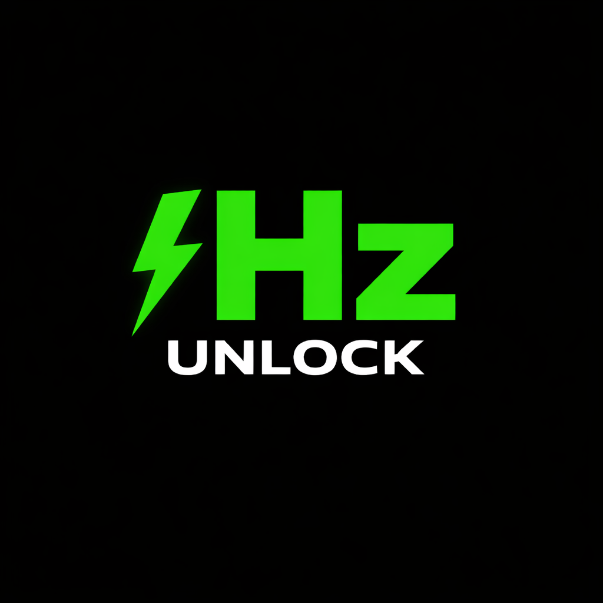

> Did HzUnlock fix your 240Hz bug? Buy me a coffee ☕ - It helps me buy more laptops to test!

 One-click tool to fix 240Hz→165Hz bug on Windows 11 laptops
HzUnlock v1.0 🚀

 Your Victus 16.1 or MSI Sword 16 HX has a 240Hz screen but Windows 11 locks it to 165Hz? HzUnlock fixes it in 3 seconds.

📦 Download

⬇️ Download HzUnlock v1.0.exe - 11.4 MB | No Python needed | Portable

📝 How to Use

1.Close all games and apps

2.Right-click HzUnlock_v1.0.exe → Run as Administrator

3.Click the Unlock 240Hz button

4.Done! Go to Display Settings → Advanced Display → 240Hz will be available

### ⚠️ Important Notes

*  Tested on Windows 11 23H2/24H2, Victus 16.1 & MSI Sword 16 HX
*  This tool uses QRes to change display modes. Use at your own risk
*  If your screen goes black, don't panic. Wait 15 seconds - Windows will auto-revert
*  You might need to run it once after every Windows Update

### 🛠️ Built With
Python 3.14 + Tkinter + PyInstaller
Author: Madura Dilshan 🇱🇰

### 📜 License
MIT License - Free to use, modify, and share

### 🐛 Found a Bug?
Open an Issue and tell me your laptop model + Windows version.
